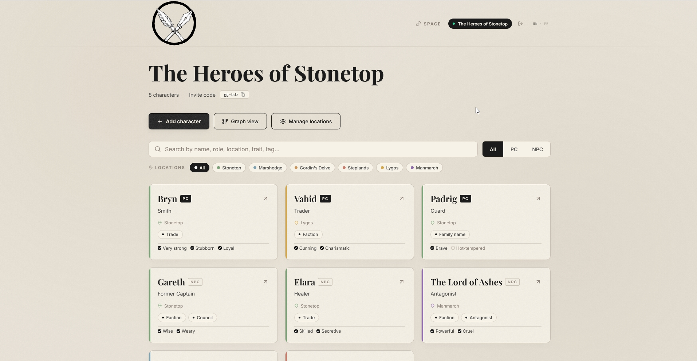

#  Ink & Stone

> A collaborative PC & NPC wiki for your TTRPG campaign.  
> No account needed. Works offline. Graph view included.

---

## What is this?

Ink & Stone is a shared character wiki built for any **TTRPG** game with a rich cast of recurring faces.

Your group joins a shared space with an invite code and password. Everyone can create and edit character sheets, link characters with typed relationships, and explore the whole cast as an interactive graph — like Obsidian, but for your table.

---

## Screenshots

<!-- Replace with your actual screenshots -->
| Main screen | Graph view | Character sheet |
|---|---|---|
|  |  |  |

---

## Features

- **Shared spaces** — join with an invite code + password, no account required
- **Character sheets** — role, location, traits, tags, and rich notes for PCs and NPCs
- **Typed relationships** — Friend, Distrust, Mentor, Companion, Acquaintance, Enemy, Rival, Family — each with a free-text detail
- **Graph view** (Sigma.js) — nodes colored by location, edges by relationship type, PC nodes larger than NPCs. Hover to highlight connections, click to open the sheet
- **Customizable locations** —  filter the grimoire by location

## [Official Website](https://inkandstone.space/)

---

##Run Locally 

> Download the app
> On your console --npm install --npm run dev

## Roadmap

- [x] French to English
- [x] Mobile layout improvements
- [ ] Supabase sync for real-time collaboration - Need some testing
- [ ] Improving graph view
- [ ] Timeline view for campaign events - Thinking about it

